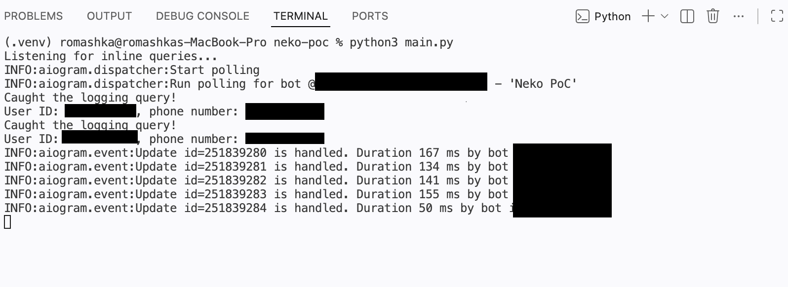

# Nekogram logging proof

A proof of Nekogram collecting phone numbers

# Requirements
- A rooted Android device  
- LSPosed  
- Aiogram 3

# How to reproduce

1. Create a bot in @BotFather, enable Inline mode in Bot Settings
2. Run the bot:
```python3 bot.py```
2. Insert your bot ID and username in module/app/src/main/java/com/yourname/nekopoc/MainHook.java
3. Build the module, install, activate it
4. Install the Nekogram app '12.5.2-6597' version from [GitHub releases](https://github.com/Nekogram/Nekogram/releases/tag/v12.5.2) (or [their Telegram channel](https://t.me/NekogramAPKs/946))
4. Open the Nekogram app, make sure the module is working by checking logcat:  
```adb logcat | grep Xposed```  
If it's running, you'll see this:  
```NekoPoC: Successfully injected into tw.nekogram```  
```NekoPoC: getBotId() called```

5. Sign in to an account, check the bot logs. The query is sent every login.

# Proof



